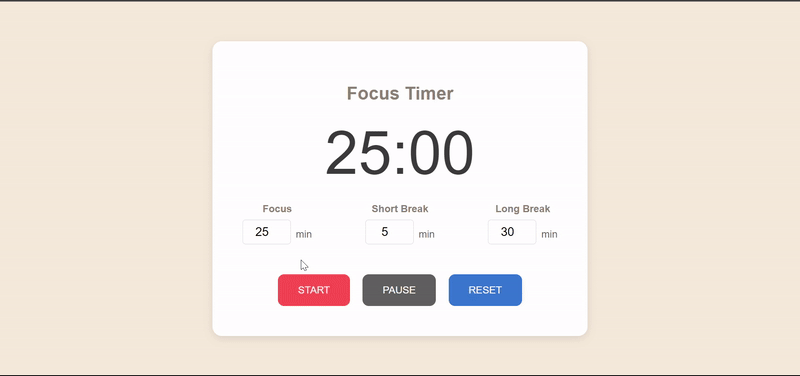
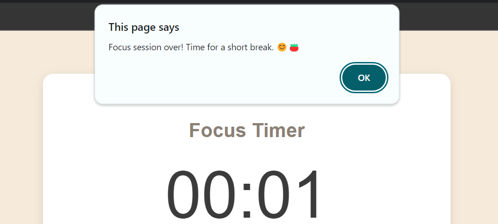
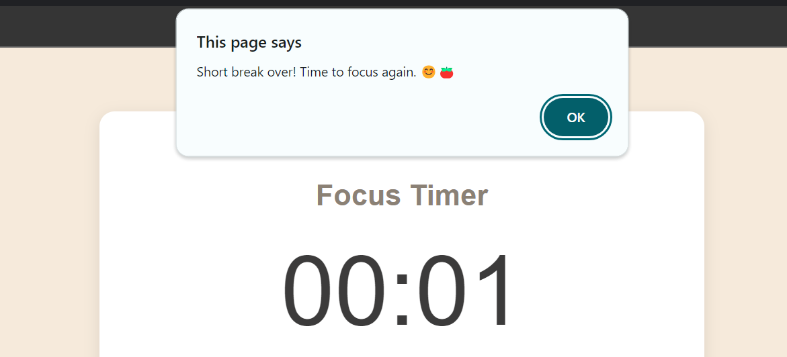
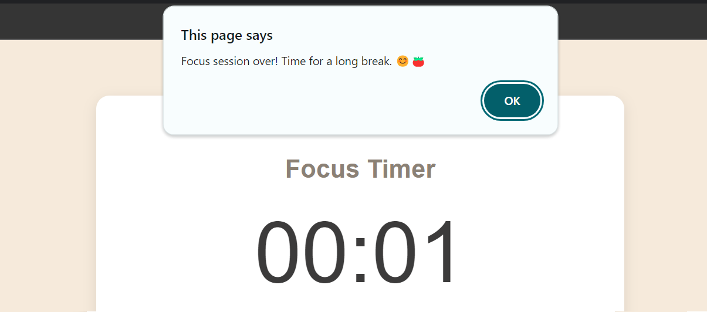

# 🍅 Pomodoro Timer

A simple, customizable Pomodoro timer built with HTML, CSS, and JavaScript. This timer helps you stay focused by alternating between work sessions and break intervals, with alert messages at the end of each session to guide you through the workflow.




## Features
- **Customizable Durations**: Set your desired focus, short break, and long break times.
- **Session Alerts**: Get alert messages at the end of each focus session, short break, and long break.
- **Pause & Resume**: Pause the timer at any time and resume later.
- **Reset Button**: Reset everything back to the initial settings (25 minutes focus, 5 minutes short break, 30 minutes long break).
- **Tomato Icon**: Custom tomato favicon to remind you of the Pomodoro Technique.

## How to Use
1. Set your desired focus, short break, and long break times.
2. Press "Start" to begin the focus session.
3. When the focus session ends, the timer automatically switches to a short break (or long break after 4 sessions).
4. Alerts guide you through each transition.
5. Pause, resume, or reset the timer as needed.

## Screenshots

### Focus Session Over


### Short Break Over


### Long Break Time


### New Focus Cycle Start


### Favicon


## How It Works
The Pomodoro timer starts with a customizable focus session. After each focus session, a short break begins automatically. Once four focus sessions are completed, a longer break begins. You will be alerted at the end of every session with a message and guided to the next step.

The timer also provides the ability to pause, resume, or reset everything to the default settings (25 minutes focus, 5 minutes short break, and 30 minutes long break).

## Technologies Used
- HTML
- CSS
- JavaScript

## Installation & Setup
1. Clone the repository:
   ```bash
   git clone https://github.com/megamiii/PomodoroTimer.git
    ```
2. Navigate to the project directory:
    ```bash
    cd PomodoroTimer
    ```
3. Open `index.html` in your web browser to start using the timer.

## Future Works
- **Session Counter:** Add a feature that tracks the number of focus sessions completed in a day.
- **Growth-based Timer:** Develop a new Pomodoro timer with a growing logic—where a plant or pet grows as long as the user stays focused on tasks. This feature will act as a visual motivator to encourage productivity over time.